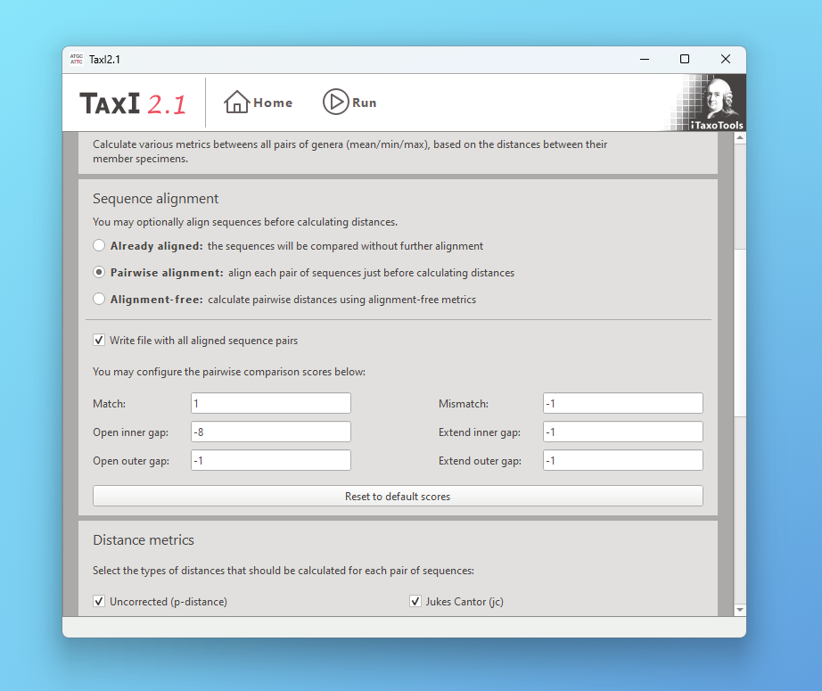

# TaxiGui

Calculation and analysis of pairwise sequence distances:

- **Versus All**: Calculate genetic distances among individuals and species
- **Versus Reference**: Find the best matches in a reference sequence database
- **Decontaminate**: Filter mismatches by comparing against two reference sequence databases
- **Dereplicate**: Remove sequences very similar to others from a dataset

This is a Qt GUI for [TaxI2](https://github.com/iTaxoTools/TaxI2).



## Windows and macOS Executables
Download and run the standalone executables without installing Python.</br>
[See the latest release here.](https://github.com/iTaxoTools/TaxIGui/releases/latest)


## Installing from source
Clone and install the latest version (requires Python 3.10.2 or later):
```
git clone https://github.com/iTaxoTools/TaxIGui.git
cd TaxIGui
pip install . -f packages.html
```

If you are also building Taxi2 from source, you will need [Rust](https://www.rust-lang.org/tools/install).

## Usage
To launch the GUI, please use:
```
taxi-gui
```

Then select one of the available modes and follow the instructions on the screen.


## Packaging

It is recommended to use PyInstaller from within a virtual environment:
```
pip install ".[dev]" -f packages.html
pyinstaller scripts/taxi2.spec
```
